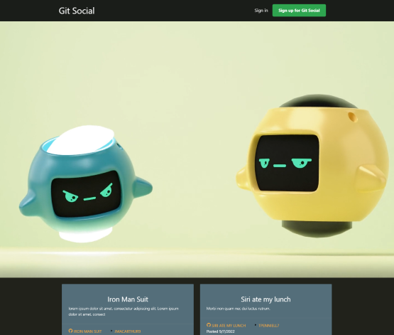
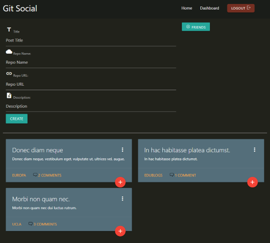

# Git Social

## Description

As A new Developer

I WANT a platform which allows me to post about the projects I'm working on

SO THAT I can seek out other new developers willing to collaborate with me so we can build our portfolios

## Table of Contents

- [Usage](#usage)
- [Technologies](#technologies)
- [Screenshots](#screenshots)
- [Questions](#questions)

## Usage

<a href="https://pacific-taiga-17313.herokuapp.com/">Git Social</a> is a social app for new developers to post about their projects and solicit help from other developers looking to build their portfolios

It's a great way to connect with other developers and discover colleagues' projects.

## Technologies

- NodeJS
- Handlbars
- Sequelize
- MySQL
- Materialize
- GitHub
- JSdocs
- Radix Icons

## Screenshots

**Landing page**

**User Dashboard**

## Questions

**How to reach us**

- <a href="https://github.com/leunggerry">Gerry</a>
- <a href="https://github.com/khalidbhaarat">Mohammad</a>
- <a href="https://github.com/joesen-dev">Joseph</a>
